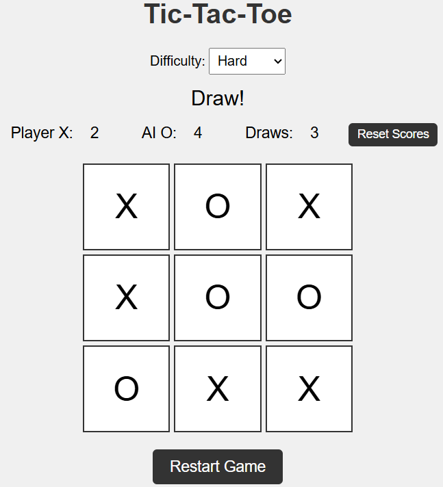

# tic-tac-toe

A fun, interactive Tic-Tac-Toe game with Easy, Medium and Difficult modes, built with HTML, CSS and JavaScript. Challenge the AI and share your score!

## Features
- Three difficulty levels: Easy (winnable), Medium (challenging), Hard (unbeatable AI)
- Light/Dark theme toggle
- Mobile-friendly design
- Persistent scoreboard with win/draw tracking
- Social media sharing with rich previews

## Play Now
[Play the game!](https://github.com/ind-maverick/tic-tac-toe)

# Screenshot

## How to Run Locally
1. Clone the repo: 'git clone https://github.com/ind-maverick/tic-tac-toe.git'
2. Start a server: 'python -m http:server 8000'
3. Open 'http://localhost:8000' ina browser

## Privacy
This game uses [Plausible Analytics](https://plausible.io) to track anonymized usage data (e.g., page views, game starts). No personal data is collected.

## Contribute
Star this repo if you enjoy the game!
Fork and submit pull requests for new features (e.g., sound effects, two-player mode)

## License
This project is licensed under the MIT License - see the [LICENSE](LICENSE) file for details.
